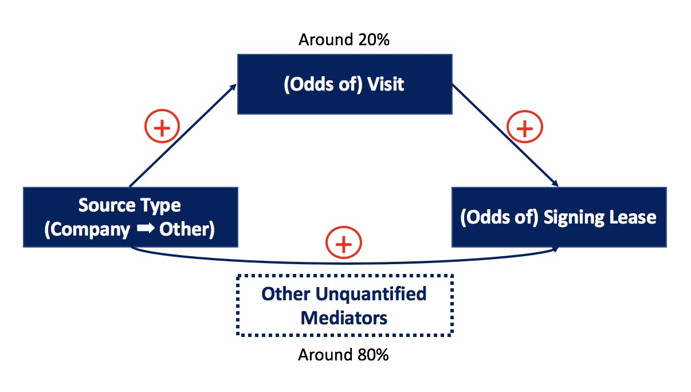

```{r setup, include=FALSE}
knitr::opts_chunk$set(echo = TRUE)
```

# Introduction

## Purpose

Some of the relationships and plots we are going to investigate include:

- EDA plots of Mixpace's Customer Visit Data from Marketing Group, such as the distribution of visitors' size
- Relationships between Lease Success Ratio and other related feture, such as Visit Status

## Data and Methods

### Database Codebook

The expected datasets for the above analysis are described as below.

1. X1: Source Type: Company resource; other
2. X2: Source Detail : Detailed source type
3. X3: Industry: Specific Industry Category based on Company name and comments
4. X4: Type: Work, Commerce or Shop
5. X5: People: Size of People
6. X6: Recommendation_Space_1: The first Space we recommend for customers
6. X7: Recommendation_Space_2: The Second Space we recommend for customers
7. X8: Time of first visit: Date of first Visit
8. Y1: Lease_or_Not: Whether the customer signed the lease

# Analysis

## Load Package
The following packages are employed:

- plyr
- ggplot2
- fitdistrplus
- GGally
- lubridate
- mediation

```{r Load Package, include=FALSE}
if(!require("plyr")){
  install.packages("plyr")
  library("plyr")
}
if(!require("ggplot2")){
  install.packages("ggplot2")
  library("ggplot2")
}

if(!require("fitdistrplus")){
  install.packages("fitdistrplus")
  library("fitdistrplus")
}

if(!require("GGally")){
  install.packages("GGally")
  library("GGally")
}

if(!require("lubridate")){
  install.packages("lubridate")
  library("lubridate")
}

if (!require("mediation")) {
  install.packages("mediation")
  library(mediation)
}
```
## Load Data
The following datasets are included:

- marketing_report_s.csv
- Supersector_Table.csv
- Industry_Code_Table.csv


```{r Load Data, include=FALSE, cache = TRUE}

marketing_report <- read.csv("marketing_report_s.csv")
Supersector_Table <- read.csv("Supersector_Table.csv")
Industry_Code_Table <- read.csv("Industry_Code_Table.csv")


```

## Process Data

The Combined and Cleaned dataset is data_marketing_valid.

```{r Process Data, echo=FALSE}

data_marketing_report <- marketing_report

for(i in c(1:4,7,9:13)) {
    data_marketing_report[,i] <- as.character(marketing_report[,i])
}

data_marketing_valid <- subset(data_marketing_report, Information_Status == "Valid")
data_marketing_valid <- data_marketing_valid[ ,!(colnames(data_marketing_valid) == c("Information_Status", "Reason_of_Lost"))]
data_marketing_valid <- data_marketing_valid[ ,!(colnames(data_marketing_valid) == c("Lost_or_Not", "Reason_of_Lost"))]

colnames(Supersector_Table) <- c("Supersector","Supersector_Name")
data_marketing_valid <- merge(data_marketing_valid, Supersector_Table, by = "Supersector")

# colnames(Industry_Code_Table)
colnames(Industry_Code_Table) <- c("Industry_Code","Industry_Name")

data_marketing_valid <- merge(data_marketing_valid, Industry_Code_Table, by = "Industry_Code")
str(data_marketing_valid)

```

## EDA Plots

The expected plots are as following:
- Distribution of the number of valid visitors(Y) VS reporter(X)

- Plots of the number of monthly valid visitors(Y) VS time(X), divided by reporter (To be included)

- Distribution of the number of valid visitors(Y) VS Source(X)

- Distribution of the number of valid visitors(Y) VS Industry(X)

- Distribution of the number of valid visitors(Y) VS Type(X)

- Distribution of the number of People

- Successful Ratio of lease(Y) VS People(x)

- Successful Ratio of lease(Y) VS Industry(x)

- Successful Ratio of lease(Y) VS Source Type and Source Detail(x)

### Distribution of the number of valid visitors(Y) VS reporter(X)
```{r EDA for marketing_report Data 1, echo = FALSE}
# Distribution of the number of valid visitors(Y) VS reporter(X)

## Generate data_marketing_valid table

mar_sum_reporter <- count(data_marketing_valid, "Reporter")

theme_set(theme_classic())
# Plot
g <- ggplot(mar_sum_reporter, aes(Reporter, freq))
g + geom_bar(stat="identity", width = 0.5, fill="tomato2") + 
      labs(title="Bar Chart", 
           subtitle="Number of Valid Visitor", 
           caption="Source: mar_sum_reporter from data_marketing_report") +
      theme(axis.text.x = element_text(angle=65, vjust=0.6))

```

### Plots of the number of monthly valid visitors(Y) VS time(X), Categorized by Source Detail

```{r EDA for marketing_report Data 2, echo = FALSE}
# Plots of the number of monthly valid visitors(Y) VS time(X), divided by reporter
data_marketing_valid$First_Contact_Date <- as.character(data_marketing_valid$First_Contact_Date)
# str(data_marketing_valid)

data_marketing_valid$First_Contact_Date <- as.Date(data_marketing_valid$First_Contact_Date, "%d/%m/%Y")    

data_marketing_valid$year <- year(data_marketing_valid$First_Contact_Date)
mar_sum_source_date <- subset(data_marketing_valid, year == "2018")
mar_sum_source_date_2 <- count(mar_sum_source_date, "First_Contact_Date")

#str(mar_sum_source_date)
#str(mar_sum_source_date_2)

# g <- ggplot(mar_sum_source_date_2, aes(First_Contact_Date, freq))
# g + geom_bar(stat="identity", width = 0.5, fill="tomato2") +
#       labs(title="Bar Chart", 
#            subtitle="Number of Valid Visitor", 
#            caption="Source: mar_sum_source_date_2 from data_marketing_report") +
#       theme(axis.text.x = element_text(angle=65, vjust=0.6))

g <- ggplot(mar_sum_source_date, aes(First_Contact_Date))
g + geom_bar(aes(fill=Source_Detail), width = 0.5) + 
theme(axis.text.x = element_text(angle=65, vjust=0.6)) +
      labs(title="Bar Chart", 
           subtitle="Number of Valid Visitor", 
           caption="Source: mar_sum_source_date from data_marketing_report") +
      theme(axis.text.x = element_text(angle=65, vjust=0.6))

```

### Distribution of the total number of valid visitors(Y) VS Source(X), Categorized by Source Detail

```{r EDA for marketing_report Data 3, echo = FALSE}
mar_sum_source_type <- count(data_marketing_valid, "Source_Type")

# g <- ggplot(mar_sum_source_type, aes(Source_Type, freq))
# g + geom_bar(stat="identity", width = 0.5, fill="tomato2") + 
#       labs(title="Bar Chart", 
#            subtitle="Number of Valid Visitor", 
#            caption="Source: mar_sum_source_type from data_marketing_report") +
#       theme(axis.text.x = element_text(angle=65, vjust=0.6))

# Draw the graph with subgroup shown together higher level group

#head(data_marketing_valid)

g <- ggplot(data_marketing_valid, aes(Source_Type))
g + geom_bar(aes(fill=Source_Detail), width = 0.5) + 
  theme(axis.text.x = element_text(angle=65, vjust=0.6)) +
  labs(title="Categorywise Bar Chart", 
       subtitle="Number of Valid Visitor", 
       caption="Source: data_marketing_valid from data_marketing_report")


```

### Distribution of the number of valid visitors(Y) VS Specific Industry(X)

```{r EDA for marketing_report Data 4.1, echo = FALSE}


mar_sum_industry <- count(data_marketing_valid, "Industry")
mar_sum_industry <- arrange(mar_sum_industry,desc(freq))
#tr(mar_sum_industry)
theme_set(theme_classic())
# Plot
g <- ggplot(mar_sum_industry, aes(Industry, freq))
g + geom_bar(stat="identity", width = 0.5, fill="tomato2") + 
      labs(title="Bar Chart", 
           subtitle="Number of Valid Visitor", 
           caption="Source: mar_sum_industry from data_marketing_report") +
      theme(axis.text.x = element_text(angle=65, vjust=0.6))

## How to avoid auto-resorting

# Distribution of the number of valid visitors(Y) VS Industry Category(X)

# str(data_marketing_valid)

# Draw plot
# ggplot(mar_sum_industry, aes(Industry, freq)) + 
#   geom_bar(stat="identity", width=.5, fill="tomato3") + 
#   labs(title="Ordered Bar Chart", 
#        subtitle="Make Vs Avg. Mileage", 
#        caption="source: mpg") + 
#   theme(axis.text.x = element_text(angle=65, vjust=0.6))

```

### Distribution of the number of valid visitors(Y) VS Industry (Supersector(X))

```{r EDA for marketing_report Data 4.2, echo = FALSE}


mar_sum_industry_supsect <- count(data_marketing_valid, "Supersector_Name")
#str(mar_sum_industry_supsect)
theme_set(theme_classic())
# Plot
g <- ggplot(mar_sum_industry_supsect, aes(Supersector_Name, freq))
g + geom_bar(stat="identity", width = 0.5, fill="tomato2") + 
      labs(title="Bar Chart", 
           subtitle="Number of Valid Visitor", 
           caption="Source: mar_sum_industry_supsect from data_marketing_report") +
      theme(axis.text.x = element_text(angle=65, vjust=0.6))

# str(data_marketing_valid)


```

### Distribution of the number of valid visitors(Y) VS Industry (Second Industry Sector(X))

```{r EDA for marketing_report Data 4.3, echo = FALSE}
mar_sum_industry_name <- count(data_marketing_valid, "Industry_Name")
#str(mar_sum_industry_name)
theme_set(theme_classic())
# Plot
g <- ggplot(mar_sum_industry_name, aes(Industry_Name, freq))
g + geom_bar(stat="identity", width = 0.5, fill="tomato2") + 
      labs(title="Bar Chart", 
           subtitle="Number of Valid Visitor", 
           caption="Source: mar_sum_industry_name from data_marketing_report") +
      theme(axis.text.x = element_text(angle=65, vjust=0.6))

# str(data_marketing_valid)


```

### Distribution of the number of valid visitors(Y) VS Type(X)

```{r EDA for marketing_report Data 5, echo = FALSE}
mar_sum_type<- count(data_marketing_valid, "Type")

theme_set(theme_classic())
# Plot
g <- ggplot(mar_sum_type, aes(Type, freq))
g + geom_bar(stat="identity", width = 0.5, fill="tomato2") + 
      labs(title="Bar Chart", 
           subtitle="Number of Valid Visitor", 
           caption="Source: mar_sum_type from data_marketing_report") +
      theme(axis.text.x = element_text(angle=65, vjust=0.6))

```

### Distribution of the number of People (Normal and Log)

```{r EDA for marketing_report Data 6.1, echo = FALSE}
hist(data_marketing_valid$People, main = "Histogram of Company Size", xlab = "People", ylim =c(0,60))


```

```{r EDA for marketing_report Data 6.2, echo = FALSE}

hist(log(data_marketing_valid$People), main = "Histogram of log of Company Size", xlab = "People", ylim =c(0,60))

```

### Successful Ratio of lease(Y) VS People(x)

```{r EDA for marketing_report Data 7, echo=FALSE, warnings = FALSE, message = FALSE}
mar_sum_ppl<- count(data_marketing_valid, "People")
colnames(mar_sum_ppl)[2] <- "Total_count" 

t <- subset(data_marketing_valid, Lease_Status == "Yes")
mar_sum_ppl_succ<- count(t, "People")
#str(mar_sum_ppl_succ)
#str(mar_sum_ppl)
mar_sum_ppl_ratio <- merge(mar_sum_ppl, mar_sum_ppl_succ, by = "People")
colnames(mar_sum_ppl_ratio)[3] <- "Success_count"
mar_sum_ppl_ratio$Success_ratio <- mar_sum_ppl_ratio$Success_count/mar_sum_ppl_ratio$Total_count
#str(mar_sum_ppl_ratio)

# Plot
g <- ggplot(mar_sum_ppl_ratio, aes(People))
g + geom_line(aes(y=Success_ratio),stat="identity", width = 0.9) + 
      labs(title="Bar Chart", 
           subtitle="Successful Lease Ratio", 
           caption="Source: mar_sum_ppl_ratio from data_marketing_report") +
      theme(axis.text.x = element_text(angle=65, vjust=0.6))
```

### Successful Ratio of lease(Y) VS Industry(x)
```{r EDA for marketing_report Data 8, echo=FALSE}

mar_ratio_industry<- count(data_marketing_valid, "Industry")
colnames(mar_ratio_industry)[2] <- "Total_count" 
# mar_ratio_industry

t2 <- subset(data_marketing_valid, Lease_Status == "Yes")
mar_ratio_industry_succ<- count(t2, "Industry")
#str(mar_ratio_industry_succ)
#str(mar_ratio_industry)
mar_ratio_industry_succ_ratio <- merge(mar_ratio_industry, mar_ratio_industry_succ, by = "Industry")
colnames(mar_ratio_industry_succ_ratio)[3] <- "Success_count"
mar_ratio_industry_succ_ratio$Success_ratio <- mar_ratio_industry_succ_ratio$Success_count/mar_ratio_industry_succ_ratio$Total_count
# str(mar_ratio_industry_succ_ratio)

# Plot
g <- ggplot(mar_ratio_industry_succ_ratio, aes(Industry, Success_ratio))
g + geom_bar(stat="identity", width = 0.5, fill="tomato2") + 
      labs(title="Bar Chart", 
           subtitle="Successful Lease Ratio", 
           caption="Source: mar_ratio_industry_succ_ratio from data_marketing_report") +
      theme(axis.text.x = element_text(angle=65, vjust=0.6))
```


## Modeling

### Producing Combined DB

The prepared Database for modeling are DB_Mod, DB_Mod_Work and DB_Mod_Shop. The reason for doing so is that data with shop attribute should be considered seperately, which does not have valid data for people but also an feature of area.

```{r Modeling Producing Combined DB, echo=FALSE}

#str(data_marketing_valid)
DB_Mod <- subset(data_marketing_valid, select = c(1:2, 4:17))
# str(DB_Mod)
print("DB_Mod")
str(DB_Mod)


## Lease_Status
DB_Mod$Lease_Status <- as.factor(DB_Mod$Lease_Status)
#levels(DB_Mod$Lease_Status)
levels(DB_Mod$Lease_Status)[1]<-"0"
levels(DB_Mod$Lease_Status)[2]<-"1"
#levels(DB_Mod$Lease_Status)

## Visit_Status
DB_Mod$Visit_Status <- as.factor(DB_Mod$Visit_Status)
#levels(DB_Mod$Visit_Status)
levels(DB_Mod$Visit_Status)[1]<-"0"
levels(DB_Mod$Visit_Status)[2]<-"1"
#levels(DB_Mod$Lease_Status)

## Source_Type
DB_Mod$Source_Type <- as.factor(DB_Mod$Source_Type)
#levels(DB_Mod$Source_Type)

## Source_Detail
DB_Mod$Source_Detail <- as.factor(DB_Mod$Source_Detail)
#levels(DB_Mod$Source_Detail)

## Industry
DB_Mod$Industry <- as.factor(DB_Mod$Industry)
DB_Mod$Industry_Code <- as.factor(DB_Mod$Industry_Code)
DB_Mod$Supersector <- as.factor(DB_Mod$Supersector)


## Type
DB_Mod$Type <- as.factor(DB_Mod$Type)

## Recommendation Space
DB_Mod$Recommendation_Space_1 <- as.factor(DB_Mod$Recommendation_Space_1)
DB_Mod$Recommendation_Space_2 <- as.factor(DB_Mod$Recommendation_Space_2)

## Create DB for those with "Work" Type

DB_Mod_Work <- subset(DB_Mod,Type == "Work")
DB_Mod_Work <- subset(DB_Mod_Work, select = c(3:5,7:15))
DB_Mod_Shop <- subset(DB_Mod,Type == "Shop")
DB_Mod_Shop <- subset(DB_Mod_Shop, select = c(3:5,8:15))

print("DB_Mod_Work")
str(DB_Mod_Work)

print("DB_Mod_Shop")
str(DB_Mod_Shop)

### ignore the shop for now
```

### Relationships Analysis

```{r Modeling and Analysis 1, include=FALSE}

fit_Work <- glm(Lease_Status~People+Source_Type+Source_Detail+Visit_Status+Industry_Name+Recommendation_Space_1, family=binomial, data=DB_Mod_Work)


fit_Shop <- glm(Lease_Status~Source_Type+Source_Detail+Visit_Status+Industry_Name+Recommendation_Space_1, family=binomial, data=DB_Mod_Shop)

summary(fit_Work)
par(mfrow=c(2,2))
plot(fit_Work, main = "fit_Work")

summary(fit_Shop)
par(mfrow=c(2,2))
plot(fit_Shop, main = "fit_Shop")

#ggpairs(fit_Work)

## To-do
### Optimize Results


```

#### Type and Lease_Status

The relationships between Lease_Status and Type are as follow. It turns out that Type is not significant for lease_status.

```{r Modeling and Analysis glm Type, echo=FALSE, cache=TRUE}

barplot(table( DB_Mod$Lease_Status,DB_Mod$Type), xlab = "Type", ylab = "Lease Status", main = "Distribution of Lease Status among Type")

fit_type <- glm(Lease_Status~Type, family=binomial,data=DB_Mod)
summary(fit_type)

```

#### Industry_Code and Lease_Status
The relationships between Lease_Status and Industry_Code are as follow. It turns out that Industry_Code is not significant for lease_status.

```{r Modeling and Analysis glm Industry_Code, echo=FALSE, cache=TRUE}

barplot(table( DB_Mod$Lease_Status,DB_Mod$Industry_Code), xlab = "Industry Code", ylab = "Lease Status", main = "Distribution of Lease Status among Industry Code")

fit_ind <- glm(Lease_Status~Industry_Code, family=binomial,data=DB_Mod)
summary(fit_ind)

```

#### Source_Type and Lease_Status
The relationships between Lease_Status and Source_Type are as follow. It turns out that Source_Type is significant for lease_status.

```{r Modeling and Analysis glm Source_Type, echo=FALSE, cache=TRUE}

barplot(table( DB_Mod$Lease_Status,DB_Mod$Visit_Status), xlab = "Source Types", ylab = "Lease Status", main = "Distribution of Lease Status among Source Types")

fit_src <- glm(Lease_Status~Source_Type, family=binomial,data=DB_Mod)
summary(fit_src)
```

#### People and Lease_Status
The relationships between Lease_Status and log(People) are as follow. It turns out that log(People) is not significant for lease_status.

```{r Modeling and Analysis glm log(People), echo=FALSE, cache=TRUE}

barplot(table( DB_Mod$Lease_Status,DB_Mod$People), xlab = "People", ylab = "Lease Status", main = "Distribution of Lease Status among People")

fit_ppl <- glm(Lease_Status~log(People), family=binomial,data=DB_Mod)
summary(fit_ppl)

```

#### Recommendation_Number and Lease_Status
The relationships between Lease_Status and Rec_NO are as follow. It turns out that Rec_NO is not significant for lease_status.

```{r Modeling and Analysis glm Rec_NO, echo=FALSE, cache=TRUE}

DB_Mod$Rec_NO <- DB_Mod$Recommendation_Space_2
DB_Mod$Rec_NO <- 2
DB_Mod$Rec_NO[DB_Mod$Recommendation_Space_2==""] <- 1


barplot(table( DB_Mod$Lease_Status,DB_Mod$Rec_NO), xlab = "Recommendation Number", ylab = "Lease Status", main = "Distribution of Lease Status among Recommendation Number")

fit_recno <- glm(Lease_Status~as.factor(Rec_NO), family=binomial,data=DB_Mod)
summary(fit_recno)

```

#### Recommendation_Space_1 and Lease_Status
The relationships between Lease_Status and Recommendation_Space_1 are as follow. It turns out that Recommendation_Space_1 is not significant for lease_status.

```{r Modeling and Analysis glm Rec1, echo=FALSE, cache=TRUE}

barplot(table( DB_Mod$Lease_Status,DB_Mod$Recommendation_Space_1), xlab = "Recommendation Space 1", ylab = "Lease Status", main = "Distribution of Lease Status among Recommendation Space 1")

fit_rec1 <- glm(Lease_Status~Recommendation_Space_1, family=binomial,data=DB_Mod)
summary(fit_rec1)
```

#### Visit_Status and Lease_Status
The relationships between Lease_Status and Visit_Status are as follow. It turns out that Visit_Status is significant for lease_status.

```{r Modeling and Analysis glm Visit_Status, echo=FALSE, cache=TRUE}

barplot(table( DB_Mod$Lease_Status,DB_Mod$Visit_Status), xlab = "Visit Status", ylab = "Lease Status", main = "Distribution of Lease Status among Visit Status")

fit_vst <- glm(Lease_Status~Visit_Status, family=binomial,data=DB_Mod)
summary(fit_vst)
```

#### Source Detail and Lease_Status

The relationships between Lease_Status and Source_Detail (considering only "Reach_Out" and "Third-Party" due to data amount) are as follow. It turns out that Source_Detail is not significant for lease_status.

```{r Modeling and Analysis glm Source_Detail, echo=FALSE, cache=TRUE}

t1 <- subset(DB_Mod,Source_Type == "Other",select = c("Source_Detail","Lease_Status","Source_Type")) 
t1 <- subset(t1,Source_Detail== "Reach_Out" | Source_Detail== "Third-Party") 


t1$Source_Detail <- as.factor(as.character(t1$Source_Detail))

barplot(table( t1$Lease_Status, t1$Source_Detail), xlab = "Source Detail", ylab = "Lease Status", main = "Distribution of Lease Status among Source Detail")

fit_src_det <- glm(Lease_Status~Source_Detail, family=binomial,data=t1)
summary(fit_src_det)


```


### Mediation Analysis

#### Relevel

```{r Mediation data preparation, include=FALSE, cache=TRUE}

DB_Mod$Src_Type_Med <- 0
DB_Mod$Src_Type_Med[DB_Mod$Source_Type == "Other"] <- 1

```

#### Regresssion 

Regress m ~ x (mediator ~ explanatory variable) and y ~ m + x (response variable ~ mediator + explanatory variable).

```{r Mediation regress, echo=FALSE, cache=TRUE}
fit_mx <- glm(Visit_Status~Src_Type_Med, family=binomial,data=DB_Mod)
summary(fit_mx)

# need to be numeric in mediation model
# don't move this line
DB_Mod$Visit_Status <- as.numeric(DB_Mod$Visit_Status)
fit_ymx <- glm(Lease_Status~Visit_Status + Src_Type_Med, family=binomial,data=DB_Mod)
summary(fit_ymx)

```

#### Mediation Model

Run the Mediation model as follow.

```{r Mediation model, echo=FALSE, cache=TRUE}

# mediation model
fit_med <- mediate(fit_mx, fit_ymx, boot = TRUE, 
                   treat = "Src_Type_Med", mediator = "Visit_Status")
summary(fit_med)

```

- Total effect:5.40e-02 
- ACME(average): 9.13e-03 
- Prop Mediated(average):1.69e-01 

- ACME(average causal mediation effect) 
- Total effect:0.059 w/ p-value 0.04 < 0.05 
- ACME(average): 0.014 w/ p-value 0.07 < 0.1 
- Proportion mediated:23.7% 

When we switch the source type from "Company" to "Other", we would expect the log odds of signing the lease increase by 0.059 (i.e., the odds of signing the lease would increase by exp(0.059) = 1.06), in which, 23% of the effects are mediated through more visits.


# Conclusion

## Interpretation

According to the exploratory data analysis result, among all the variables considered, only "Source Type" and "Visit Status" have significant effect on the variable of interest "Lease Status".  Thus only these two variables would be used during modeling process. Logistic regression is further employed to explore the relationship between "Source Type" and "Visit Status". Since these two variables are highly correlated, linear model should not be used here due to multicollinearity problem, which could lead to biased estimates.

Based on my experience and research, mediation model works better in this scenario. The result is shown as follow. When we switch the "Source Type" from "Company" to "Other", we would expect the log odds of signing the lease increase by 0.059 (i.e., the odds of signing the lease would increase by exp(0.059) = 1.06, also known as the probability of signing the lease increase by 51%), in which, 23% of the effects are mediated through "Visit Status". Meanwhile, when we switch the "Visit_Status" from "(0)No" to "(1)Yes", we would expect the log odds of signing the lease increase by 1.136 (i.e., the odds of signing the lease would increase by exp(1.136) = 3.11, also known as the probability of signing the lease increase by 75%). In sum, in the mediated way, when we switch the "Source Type" from "Company" to "Other", the odds of visit would increase, thus increase the odds of signing the lease. In the unmediated way, the switch from  "Company" to "Other" would also increase the odds of signing the lease.



## Strategy Recommendation

In order to increase the chances of signing leases, the most effective way is to bring more customers to come and visit instead of learning through other channels, which increases probability of signing the lease by 75%. The second recommendation is to focus on customers from "Other" Source Type, which are "Reach_Out" and "Third-Party" in our case. It increases probability of signing the lease by 51%. Meanwhile, it is more cost-effective to focus on getting customers from the "Other" Source Type, comparing to bring them to come and visit. All other observed factors have not shown significant effect on the successfully signing the lease.

